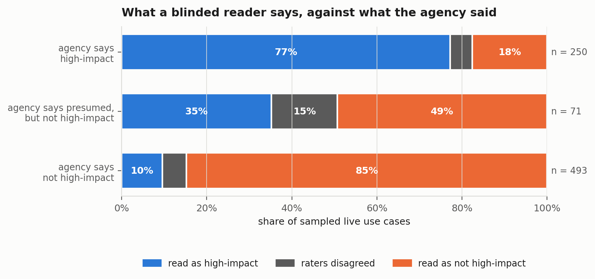
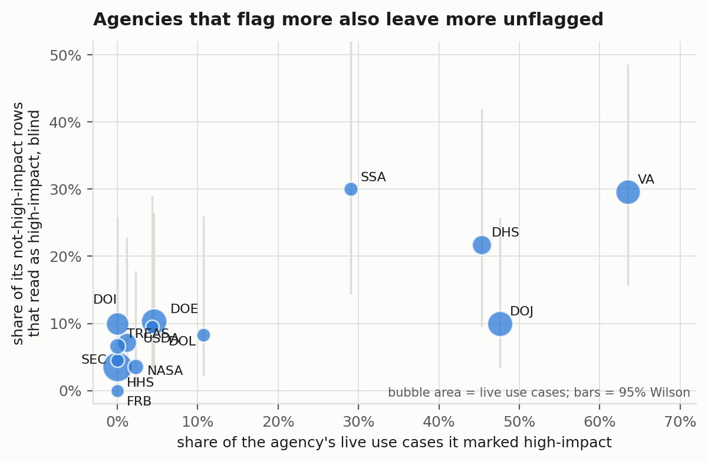

# What the largest AI buyer says it bought

An audit of the 2025 Federal AI Use Case Inventory: what the U.S. government says it has
deployed, whether the entries are complete, whether a blinded reader applying the
government's own definition of "high-impact AI" agrees with the agencies' self-determinations,
and whether any of it carries evidence of performance.

**Paper:** [`paper/fed-ai-inventory-audit.pdf`](paper/fed-ai-inventory-audit.pdf) ·
**Preregistration:** [`docs/PREREGISTRATION.md`](docs/PREREGISTRATION.md) ·
**Rater instruction:** [`docs/RATER_PROMPT.md`](docs/RATER_PROMPT.md)

---

## The result

OMB's consolidated 2025 inventory lists **3,611** AI use cases from 41 agencies, **1,480** of
them deployed or piloted. Under OMB Memorandum M-25-21 each agency decides for itself whether a
use case is high-impact and therefore subject to six minimum risk-management practices.

Three findings are mechanical and exact:

- **A tenth of the inventory is a name and nothing else.** 338 rows (Commerce, TVA, Education)
  have no development stage, no impact determination and no description. Of all missing
  required cells, 84% are missing because the agency left the column out of its public file.
- **Of the 227 deployed use cases agencies marked high-impact, 33 report all six minimum
  practices complete**, 78 report none complete, and 101 report nothing because the Department
  of Veterans Affairs, which holds 94 of them, did not publish those columns.
- **Of 1,480 live use cases, 37 state a numeric performance figure, 9 say what it was measured
  over, and none states an uncertainty.**

The fourth needed a blinded reading. Six independent passes rated 844 live use cases against
the memo's definition and its fifteen presumed-high-impact categories, seeing the description
and nothing else:

| agency said | rows | read as high-impact (both passes) | calibrated |
|---|---:|---:|---:|
| high-impact | 250 | 81% | 82% |
| presumed high-impact, but overrode it | 71 | 42% | 54% |
| not high-impact | 493 | **10 percent** | **26 percent** |

Where the agency explicitly overrode a presumption, a blinded reader disagreed **42 percent** of
the time, and **47 of those 110** override justifications are shared template text. Justice
lists the federal recidivism instrument **PATTERN** twice, once high-impact and once not, and
marks a CAPTCHA widget as high-impact AI.

**Two preregistered predictions held, three failed, one was untestable.** The one that failed
hardest reversed the premise: the agencies reporting zero high-impact AI (HHS, Interior,
Treasury) are not under-classifying. Their unflagged rows read as high-impact 7% of the time.
At VA, Justice and DHS, the agencies that flag the most, the rate is 20%.





## How it was done

1. **Population, not sample.** OMB's consolidated CSV at commit `06c7ebe` is every publicly
   reported individual use case. Structured-field counts carry no sampling uncertainty.
2. **Preregistration** written after the structured fields were profiled and before any free
   text was read, any screen run, any matching attempted. It says what had been seen.
3. **Rubric.** Category (one of M-25-21's fifteen presumption categories, or none), decision
   role (principal / assistive / none), five evidence judgements, and a stage reading.
   Derived: `high_impact` = category ≠ none AND role ≠ none.
4. **Blinding.** Raters see name, topic, classification and four description fields. Agency,
   bureau, stage, determination, justification, vendor and every practice field are hidden.
   789 agency and bureau tokens redacted. Seeded shuffle. Every row rated by two of six passes.
5. **Calibration, three parts.** (a) 118 blinded re-reads with duplicate controls, stratified
   over agreed-high / agreed-not / disputed. (b) An exhaustive numeral screen over all 1,480 live
   rows, every candidate read blind, so the evidence counts are exact. (c) A frozen keyword
   screen for the presumption categories, whose precision the blinded readings measure.
6. **Statistics.** Wilson intervals, agency-cluster bootstrap, a calibration bootstrap, and
   Krippendorff's alpha. Both raw and calibrated rates are reported side by side.

## What the calibration found

On the crisp question (does the text contain a performance figure) the automated passes were
exact: the reviewer and the passes coincided on 19 of 19 quantified calls inside the sample,
with one over-call on a claim of "orders-of-magnitude" savings. On the graded question (does
this description fall under the high-impact definition) the passes under-called: the reviewer
overturned 6 of 40 agreed-not rows and resolved 23 of 30 disputed rows as high-impact, which
moves the not-high-impact rate from 10% to 26%. The paper argues this is predictable from how
crisply a question can be settled by pointing at the input, and reports both numbers.

The numeral screen had false negatives ("by a third", "by 2/3", "from one week to one day",
"within 3-meters") that the passes' independent calls exposed. It was extended, the 97 added
candidates were read blind, and both versions are published (Amendment 1).

The stage rubric did not reproduce (alpha 0.37) and is reported as a negative result: the
inventory's free text does not let a reader verify the stage field (Amendment 3).

## Also in the paper

- **Churn.** 39% of 2024 entries have no name match in 2025. A blinded review of 60 finds 27
  renames, 5 already retired, 9 commercial products moved to consolidated reporting, and 19
  with no successor, so silent disappearance is at most 12 to 18 percent.
- **Vendors.** 378 vendor strings normalised to 375 parents. Microsoft is named on 17.6% of
  vendor-named live rows, then Google, Deloitte, OpenAI, Palantir. Top five hold 34.6%, which
  failed the preregistered prediction of more than half.

## Reproducing it

```bash
pip install -r requirements.txt
./run_all.sh
```

`src/verify_paper.py` recomputes every number quoted in the paper and this README from the
results on disk and exits non-zero on any mismatch: **235 checks, zero failures**. It also
checks that the sentences quoted from the inventory appear verbatim in it and that the named
examples (PATTERN, Cloudflare Turnstile) carry the determinations the paper says they do.

## Layout

```
src/frame.py                 load, provenance, structured tabulations
src/build_rating_sets.py     sample, redact, shuffle, assign to six passes
src/validate_ratings.py      schema-check all 1,688 judgements
src/agreement.py             observed agreement, Krippendorff alpha, agreed/disputed split
src/numeral_screen.py        exhaustive numeral screen, v1 and v2
src/presumption_screen.py    frozen keyword screen for the fifteen presumption categories
src/build_calibration.py     blinded calibration materials
src/calibrate.py             unblind, survival rates, screen checks
src/completeness.py          RQ1 against the reporting instructions, split by cause
src/churn.py                 RQ5 year-over-year matching
src/vendors.py               RQ6 vendor normalisation and concentration
src/analyze.py               every number in the paper
src/figures.py               figures
src/verify_paper.py          recompute every quoted number, fail loudly
src/stats.py                 Wilson, cluster bootstrap, transfer matrix, self-checks

data/raw/                    OMB's 2025 and 2024 files, dictionaries, sourcing summary
data/rating/                 blinded item files and all 1,688 rater judgements
data/calibration/            blinded calibration materials, keys, reviewer judgements
results/                     agreement, calibration, completeness, churn, vendors, analysis
docs/PREREGISTRATION.md      written before the free text was read, with five amendments
docs/RATER_PROMPT.md         the instruction the six passes were given, committed before dispatch
```

## A note on the raters

The rating passes are Claude Sonnet and the calibration reviewer is Claude Opus 5, the model
orchestrating the study. No figure here measures human agreement. Every sentence and every
judgement is published so that a reader who disputes a call can look at the row and say so.

## Companion studies

- [ai-claims-audit](https://github.com/ishaanshah101/ai-claims-audit): the same design on AI
  claims in corporate annual reports. One checkable claim in 598 sentences.
- [kfuji-annotation-audit](https://github.com/ishaanshah101/kfuji-annotation-audit): the same
  design on a computer-vision benchmark, where the calibration pass caught an automated stage
  wrong by nearly a factor of nine.

## License

MIT. The inventory files are works of the U.S. government and are reproduced from OMB's public
repository with their commit hashes.
