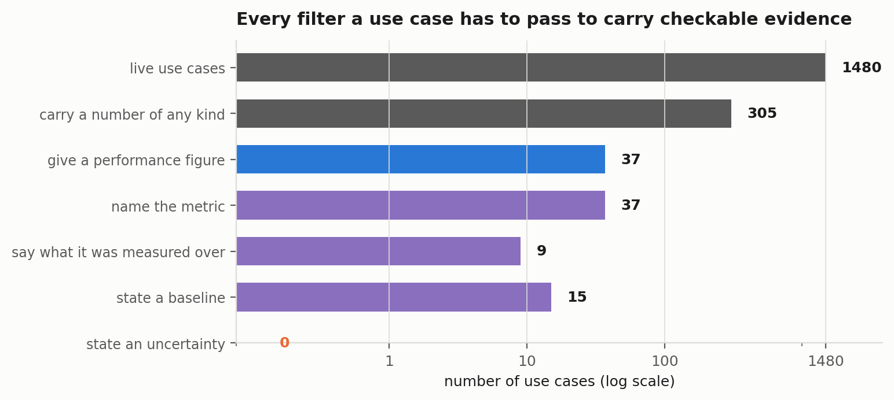
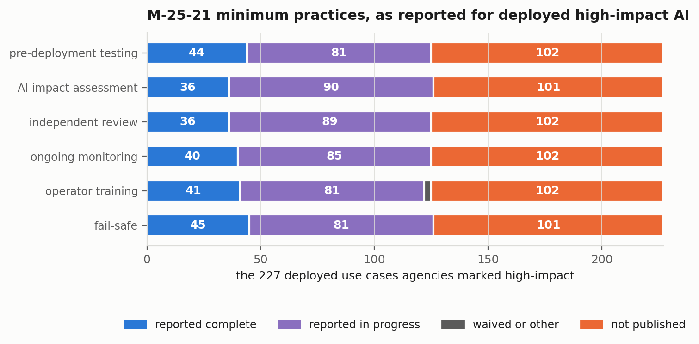
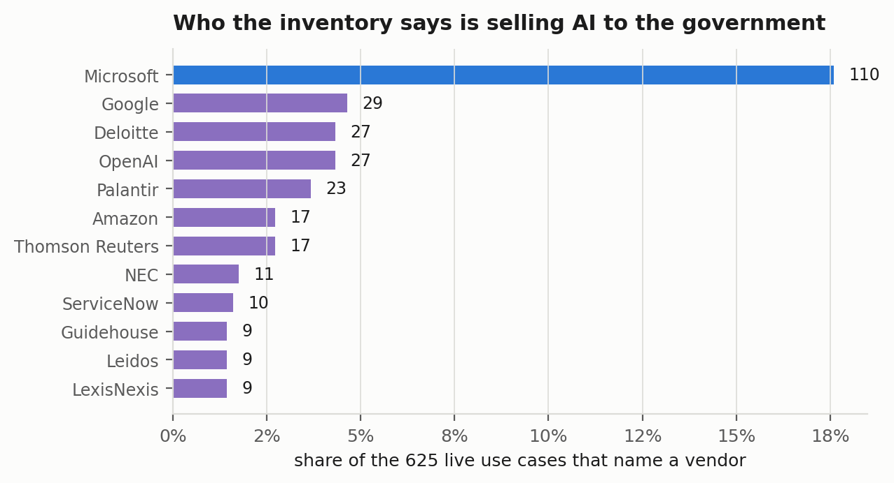

## Abstract

Since 2020 every federal agency outside national security has been required to publish
an annual inventory of its AI use cases, and since April 2025 the agency itself decides
whether each one is "high-impact" and therefore subject to seven minimum risk management
practices. The 2025 inventory lists 3,611 use cases from 41 agencies. This paper checks
the parts of it that can be checked from the public text.

Three findings are mechanical and exact. Nine percent of the inventory is a name and
nothing else: Commerce, TVA and Education published no development stage, no impact
determination and no description for 338 rows, and 84 percent of all missing required
cells are missing because the agency left the column out of its public file rather than
because a cell was blank. Of the 227 deployed use cases agencies themselves marked
high-impact, 33 report all six minimum practices complete, 78 report none complete, and
101 report nothing at all because the Department of Veterans Affairs, which holds 94 of
them, did not publish those columns. Of 1,480 live use cases, 37 state any numeric
performance figure, 9 say what it was measured over, and none states an uncertainty.

The fourth finding needed a blinded reading. Six independent passes rated 844 live use
cases against the memo's own definition and its fifteen presumed-high-impact categories,
seeing the description and nothing else. Where the agency said not high-impact, 10
percent read as high-impact, 26 percent after calibrating the passes against a more
careful blinded review. Where the agency explicitly overrode a presumption, a blinded
reader disagreed with the override 42 percent of the time, and 47 of those 110 overrides
share template justification text. Where the agency said high-impact, 19 percent read as
not: the Department of Justice lists a CAPTCHA widget and an HR chatbot as high-impact
AI, and lists the federal recidivism instrument PATTERN twice, once high-impact and once
not. Two preregistered predictions held, three failed and one proved untestable, and one
failure reversed the study's premise: the agencies that self-report zero high-impact use
cases are not hiding them, and the agencies that flag the most are also the ones with the
most unflagged.

## 1. Introduction

The United States government is the largest single buyer of AI in the world. Executive
Order 13960, signed in December 2020, made it the first to require that every agency
outside the national security community publish an inventory of where it uses AI, and
the Advancing American AI Act of 2022 wrote the requirement into statute. OMB
Memorandum M-24-10 in March 2024 added a governance layer, and OMB Memorandum M-25-21
in April 2025 rescinded and replaced it. The 2025 memo defines "high-impact AI" as AI
whose output "serves as a principal basis for decisions or actions with legal,
material, binding, or significant effect" on rights, benefits, health, safety,
infrastructure or strategic assets. It lists fifteen categories of use that are
presumed high-impact, from patient diagnosis to biometric identification to benefits
adjudication. It requires seven minimum risk management practices for high-impact AI
within 365 days, on pain of the use being discontinued. And it makes the agency the
judge of whether its own use case is high-impact, subject only to a requirement that
an official document in writing any decision to override a presumption.

The inventory is therefore a self-report at every level. The agency decides what to
list, what stage it is at, whether it is high-impact, and whether the practices are
done. OMB consolidates what agencies post and publishes the result, with a summary
table that treats each agency's numbers as given. Nobody outside the agency checks
whether the description supports the classification, and until now nobody has tried.

This paper does the checking that the public text permits. Some of it is arithmetic:
whether the fields the reporting instructions mark as required are filled, what the
minimum-practice columns actually say, whether a use case listed in 2024 can be found
in 2025, and who the vendor field names. Some of it needs a reader: whether a
description of a use case, read by someone who does not know which agency wrote it or
what box the agency ticked, falls under the memo's definition. The design for that
part is the one used in two companion audits, of a computer-vision benchmark and of
AI claims in corporate annual reports: a rubric written down before any text is read,
two independent blinded passes over every sampled row, a calibration pass by a more
careful reader who also does not see the verdicts, and a set of mechanical screens that
enumerate rather than sample so that the counts they bound are exact.

The results are less tidy than the companion audits, and more interesting for it.
Three of the six preregistered predictions failed. The one I expected most confidently,
that the agencies reporting zero high-impact use cases would turn out to have the
highest rate of unflagged ones, was wrong in the other direction. That is reported in
Section 5.3 with the same prominence as the findings that went the way I expected.

## 2. Related work

The academic literature on federal AI inventories is thin, because the inventories
are new and until 2024 were inconsistent enough to defeat analysis. The Government
Accountability Office reviewed the first round in 2023 and found that agencies had
reported about 1,200 use cases, that the inventories were incomplete and inconsistent
across agencies, and that OMB had not yet issued the guidance the executive order
required (GAO 2023). Stanford's RegLab reached a similar conclusion from the 2022
inventories, documenting that a large share of agencies had failed to publish one at
all and that the ones published disagreed on what counted as a use case (Lawrence,
Cui and Ho 2023). Both studies are about whether the inventories exist and whether
they are internally consistent. Neither reads the entries against the governing
definition, because in 2022 and 2023 there was no operational definition to read them
against.

M-25-21 changed that by supplying one. Its high-impact definition is precise enough
that two readers can apply it independently and be scored for agreement, and its
fifteen presumption categories are concrete enough to screen for by keyword. That is
what makes this study possible and what makes it different from the earlier ones: the
question is no longer whether agencies filled in the form but whether what they wrote
in the form supports what they ticked.

The method draws on work that is not about government at all. Bean et al. (2025)
reviewed 445 language-model benchmarks with 29 expert reviewers and found pervasive
failures of construct validity, meaning benchmarks that do not measure what they
claim. Raji, Bender, Paullada, Denton and Hanna (2021) argued that the gap between a
benchmark's stated construct and what it actually tests is hidden precisely because
nobody writes the construct down. A high-impact determination is a construct-validity
judgement of the same kind, made by an interested party, about a system the party
built or bought. The audit treats it accordingly.

The two companion studies supply the specific design. The KFuji annotation audit (Shah
2026a) found that a chain of automated passes could produce a confident, internally
consistent number that was wrong by nearly a factor of nine, and that only a cheap
blinded re-check caught it. The audit of AI claims in annual reports (Shah 2026b) used
the same design on text and found the automated passes accurate on the judgement that
carried the headline. This study sits between those two outcomes, and Section 6.3
argues that the difference is predictable from how crisp the judgement is.

## 3. The data

The 2025 inventory is OMB's consolidation of what each agency posted on its own
website, published as a repository with a data dictionary, a validation report and a
sourcing summary that records, for each agency, which columns the agency left out of
its public file. This study uses the repository at commit `06c7ebe` of 14 May 2026:
3,611 individually reported use cases from 41 agencies, plus a separate file of
consolidated commercial off-the-shelf uses that is not analysed here. The 2024
consolidated inventory, 2,133 rows at commit `4a29d13`, is used only for the
year-over-year question. Both files are committed with their hashes.

The inventory is the population of publicly reported individual use cases, not a
sample of it. Counts over its structured fields therefore carry no sampling
uncertainty. What they carry is whatever the agencies put in the boxes, which is the
subject of the study.

Every row has a development stage (Pre-deployment, Pilot, Deployed, Retired, or
blank), a high-impact determination (High-impact, Presumed high-impact but determined
not, Not high-impact, or blank), a topic area, an AI classification, four free-text
fields describing the problem, the benefits, the outputs and the data, a contracting
field with a vendor name, and, for deployed high-impact rows only, nine fields
reporting the status of each minimum practice. Of the 3,611 rows, 1,040 are marked
Deployed and 440 Pilot. I call those 1,480 rows the live set.

## 4. Method

### 4.1 What was fixed in advance

The preregistration in `docs/PREREGISTRATION.md` was written after the structured
fields had been profiled and before any free text was read for rating, any screen was
run, any year-over-year matching was attempted, or any vendor string was tabulated. It
states which tabulations had already been seen, and it makes no prediction about them.
Six predictions were written on the parts not yet examined. The rater instruction was
committed to `docs/RATER_PROMPT.md` before any rater was dispatched, which the
companion audit of annual reports did not do and listed as a limitation.

### 4.2 The rubric

Raters saw seven fields: the use case name, topic area, AI classification, and the
four free-text descriptions. They did not see the agency, bureau, development stage,
the agency's determination or its justification, the vendor, the PII flag, or any
minimum-practice field. Agency and bureau names and their abbreviations, 789 tokens in
all, were replaced with `[agency]`.

**Part A** records two judgements. `category` is the single lettered presumption
category from M-25-21 Section 6 that the described use most closely falls into, or
`none`. The fifteen categories were reproduced verbatim in the instruction.
`decision_role` is `principal` if the text describes the AI output as determining or
being the main basis for a decision or action about a person, a benefit, an
enforcement outcome or physical safety. It is `assistive` if the output informs,
flags, ranks, drafts or recommends for a human who decides, and `none` if no such
decision or action is described. The derived reading, fixed in advance, is `high_impact` when the
category is not `none` and the decision role is not `none`. The memo states that a
high-impact determination "is possible whether there is or is not human oversight," so
an assistive role does not exempt. A stricter variant requiring `principal` is
reported alongside as a floor.

**Part B** records five binary evidence judgements identical to the annual-report
audit: `quantified`, `metric_named`, `evaluation_described`, `baseline_given`,
`uncertainty_given`. A use case is `checkable` if the first three are true. The
instruction is explicit that a count of users, a budget, a date, a training-set size or
a volume of records processed is not a performance figure.

**Part C** asks whether the text describes the system as `in_use`, `not_yet`, or
`unclear`, to be compared afterwards with the agency's own stage.

### 4.3 The sample

The rated sample is drawn from the 1,450 live rows with a non-empty description:
every row the agency marked High-impact (250), every row marked Presumed but not
(71), every live row with a blank determination (30), and up to 30 rows per agency
from those marked Not high-impact under seed 20260926 (493). That is 844 rows, each
assigned to two of six raters by a fixed rule, 1,688 judgements, 280 to 282 per rater.

### 4.4 The passes and the calibration

The six passes ran as independent Claude Sonnet subagents with no shared context. A
schema validator confirmed every line, every assigned row, no duplicates and no
omissions before anything else was computed.

Calibration has three parts. The first re-reads a seeded sample of 110 rated rows, 40
that both passes read as high-impact, 40 that both read as not, and 30 where they
disagreed, presented in a shuffled order with eight rows repeated under a second
identifier as self-consistency controls. I read all 118 displays and recorded a
category, role and stage for each before the key was opened. The second part is the
numeral screen: a performance figure needs a number, so every live row was screened for
one and every candidate read blind. The third is the presumption keyword screen, a
fixed regular expression per category built from the memo's own words and frozen before
it was run, whose precision the blinded readings then measure.

### 4.5 Statistics

Population counts carry no interval. Rates from the rated sample carry Wilson
intervals, and where rows nest within agencies, a percentile bootstrap resampling
agencies with 10,000 replicates. The calibrated rate for the not-high-impact stratum
is bootstrapped jointly over the calibration units. Agreement is observed agreement
and Krippendorff's alpha for nominal data. `src/stats.py` runs its own checks and
`src/verify_paper.py` recomputes every number in this paper from the raw data.

## 5. Results

### 5.1 A tenth of the inventory is a name and nothing else

Against the fields the reporting instructions mark as required for each row's stage,
the inventory is 91.3 percent complete: 38,031 of 41,642 required cells are filled.
The number that matters is what the other 3,611 cells are. OMB's own sourcing summary
records which columns each agency dropped from its public file, and 3,033 of the
missing cells, 84 percent, are in columns the agency did not publish at all. Only 578
are cells left blank inside a column the agency did publish. The public inventory's
incompleteness is mostly a decision not to publish, not a failure to answer.

The extreme case is 338 rows, 9.4 percent of the inventory, with no development
stage and no impact determination. All of them come from three agencies. The
Department of Commerce published 223 rows containing a name, a bureau and a contact
address, and for 25 of them a one-line problem statement. TVA published 59 rows with a
name, a topic and a benefits line. Education published 56 with a name, a problem and a
benefit. OMB's summary table nevertheless reports Commerce as having 223 use cases,
223 of them deployed and none high-impact, which is not supported by anything in the
file. Thirty of the 41 agencies omitted at least one required column.

### 5.2 The passes agree, and the disagreement is where the definition is soft

Across the 844 rated rows the two passes gave the same category 91.7 percent of the
time (alpha 0.850), the same decision role 88.2 percent (alpha 0.777), and the same
derived high-impact reading 93.8 percent (alpha 0.864). The stricter principal-only
reading agreed 99.2 percent, which mostly reflects how rarely either pass used
`principal`: 57 of 1,688 judgements.

The 52 disputed readings sit where the rubric asks a graded question. Twenty-three of
them are one pass calling a law-enforcement category and the other calling `none`, on
sentences about database tools, entity resolution and investigative search where the
text does not say whether anything downstream depends on the output. The blinded
reviewer resolved 23 of the 30 disputed rows in the calibration sample as high-impact.

Part B agreed as it did in the annual-report audit: `quantified` 99.9 percent (alpha
0.975), the other four between 96 and 99 percent. Part C did not agree. The stage
reading matched 68.1 percent of the time with alpha 0.372, and Section 5.6 reports why.

### 5.3 The blinded reading against the agency's box

Of the 250 sampled rows agencies marked High-impact, both passes read 193 as
high-impact and 44 as not, with 13 disputed: 81.4 percent agreement with the agency
(Wilson 76.0 to 85.9). Of the 493 rows marked Not high-impact, both passes read 47 as
high-impact, 418 as not, 28 disputed: 10.1 percent of the agreed rows read as
high-impact (Wilson 7.7 to 13.2, agency bootstrap 6.6 to 14.0). Of the 71 rows where
the agency invoked the override, "presumed high-impact but determined not," both
passes read 25 as high-impact and 35 as not, 11 disputed: 41.7 percent (Wilson 30.1
to 54.3).

The calibration moves the second of those numbers a long way. On the 40 calibration
rows both passes had read as not high-impact, I read 6 as high-impact, a survival rate
of 85 percent, and I resolved 23 of 30 disputed rows as high-impact. Applying those
rates, the calibrated share of not-high-impact rows that read as high-impact is 26.4
percent, with a calibration bootstrap interval from 17.7 to 36.4. The corresponding
survival on the high side was 39 of 40, so the calibrated agreement with an agency's
high-impact determination stays at 81.9 percent, and the calibrated disagreement with
an override rises to 53.6 percent.

I report the raw and calibrated figures side by side rather than choosing, because
the gap between them is itself a result about the method (Section 6.3). The
conservative reading is that one in ten use cases an agency says is not high-impact
reads as high-impact to two independent readers who agree with each other. The
calibrated reading is one in four. Either way, extrapolating the per-agency sampled
rates to the 1,129 live not-high-impact rows in the population gives an estimated 106
use cases, against the 250 live use cases agencies themselves marked high-impact, on
the raw rate alone.

Two preregistered predictions were about this. The first, that at least 15 percent
of not-high-impact rows would read as high-impact, fails on the raw rate and holds on
the calibrated one. The preregistration did not say which, and I score it as not
cleanly held. The second was that disagreement would concentrate in the agencies that
self-report zero high-impact use cases, on the theory that an agency reporting none
among hundreds of live systems is under-classifying. It failed, and in the opposite
direction.

The three large agencies reporting zero high-impact live use cases, HHS, Interior and
Treasury, had 6 of 88 sampled not-high-impact rows read as high-impact, 6.8 percent.
The three that report the most, VA, Justice and Homeland Security, had 16 of 80, or
20.0 percent. The bootstrap difference is 13 points the wrong way, with an interval
from 4 to 23 that excludes zero. VA, which marks 64 percent of its live use cases
high-impact, had 8 of 27 of its remaining rows read as high-impact. SSA, which marks 29
percent, had 6 of 20. HHS, with 255 live use cases and no high-impact ones, had 1 of 28.

The explanation is in what the agencies do. HHS's inventory is dominated by research
models and internal tools at NIH, CDC and FDA. Interior's is dominated by USGS science.
Treasury's is IRS document processing. Those are the agencies where a blinded reader,
handed the description, finds nothing that touches a person's rights or benefits.
VA's inventory is medical devices and clinical decision support, Justice's is
investigative tools, Homeland Security's is border and immigration systems. Those
agencies classified a lot as high-impact because a lot of what they do is, and what
they left unflagged is drawn from the same distribution. The prediction assumed that
agency-level variance in self-reporting was a measurement artefact. It is mostly
signal, and the residual disagreement scales with the agency's exposure rather than
with its reticence.

The categories the readers assigned to the rows they read as high-impact tell the same
story: healthcare (f) 97 times, law enforcement (j) 89, benefits and services (m) 38,
safety-critical infrastructure (a) 17. Everything else is single digits.

Three individual cases are worth naming, because every judgement in this study is
published and a reader can check them. Justice lists the Prisoner Assessment Tool
Targeting Estimated Risk and Needs, PATTERN, the federal Bureau of Prisons' recidivism
instrument, in two rows. One says the tool "uses pre-defined rules to score an inmate's
recidivism risk level" and is marked Not high-impact. The other says the intended use
is "to predict the risk of recidivism for incarcerated adults" and is marked
High-impact. Both passes read both rows as category j, assistive, high-impact.
M-25-21's presumption list names "determinations related to recidivism" in so many
words. In the other direction, Justice marks as high-impact a row named Cloudflare
Turnstile, which is a CAPTCHA replacement, a row named Building Automation Systems,
and a Chatbot to Answer Internal Employee Policy Queries. Both passes read all three as
no category. Thirty-two of Justice's 314 rows invoke the override, and all 32 carry the
same justification sentence, verbatim.

That last point generalises. Of the 110 rows across the inventory where an agency
overrode a presumption, 47 share a justification text used three or more times, and 32
of those are Justice's single sentence. The memo requires "written documentation" for
an override. The inventory suggests that at some agencies the documentation is a
template.

### 5.4 Thirty-seven use cases give a number, nine say what it means, none gives an interval

The numeral screen, in its extended form (Amendment 1), flagged 305 of the 1,480 live
rows as carrying a number of any kind. I read all 305 blind. Thirty-seven contain a
numeric performance figure attributed to the AI, 2.5 percent of live use cases (Wilson
1.8 to 3.4). All 37 name the metric, 15 give a baseline, 9 say what data, population or
period the figure was measured over, and none states an interval, a sample size or an
error estimate. Nine use cases in the federal inventory, 0.61 percent (Wilson 0.32 to
1.15), are checkable in the study's sense.

The two automated passes, on the 185 candidates that fell inside the rated sample,
marked 20 rows quantified and I marked 19. The 19 coincide, and the one the passes
added was a NASA toolkit claiming "orders-of-magnitude reductions" without a number.
Four rows the passes marked quantified were outside the original screen, and they are
why the screen was extended.

The nine checkable claims are what good disclosure looks like at the scale a form
allows. VA reports that randomised implementation of computer-aided detection during
colonoscopy across its facilities produced "a statistically significant 21% increase in
the odds of adenoma detection" against colonoscopy without it. Interior reports a
convolutional network reaching 78 percent validation accuracy on stream PFAS data
against 65 percent for logistic regression and boosting. VA reports its Privacy Act
automation cut response time on lower-complexity cases "from over a month to less than 4
days" across more than 25,000 cases since deployment. These are not audited numbers.
They are numbers with enough context that an auditor would know where to start, and
there are nine of them.

Most of the 37 are not like that. "Reduces time spent searching course materials by
over 80%." "Up to 60–80% reduction in inquiry volume." "Detects cooling towers
approximately 600 times faster than manual searches." A figure, a direction, and
nothing to measure it against. And many of the rows I did not count are ones that state
a volume: 2 million actions in a year, 25,000 cases processed, 15,000 emails handled. A volume tells you the system is busy. It does not tell you whether it is
right.

### 5.5 Of 227 deployed high-impact use cases, 33 report all six practices done

M-25-21 gave agencies 365 days from 3 April 2025 to document six practices for every
high-impact use: pre-deployment testing, an AI impact assessment, an independent
review, ongoing monitoring, operator training and a fail-safe. Inventories were due to
OMB on 22 December 2025, three and a half months before that deadline, so in-progress
answers are not violations. The question is what agencies said.

For the 227 deployed use cases marked high-impact, the six practices are reported
complete on between 36 and 45 rows each. In-progress is reported on 81 to 90. Between
101 and 102 rows report nothing, and that number is not a mystery: VA holds 94 of the
227 and did not publish any of the minimum-practice columns, and NCUA, FDIC and NASA
account for the other 7. Thirty-three use cases report all six complete, 26 of them at
Homeland Security and 7 at SSA. Seventy-eight report every practice as in-progress and
none complete, and 73 of those are Justice's entire deployed high-impact inventory.

Read by agency, the picture is three different postures. Homeland Security reports the
practices done on 26 of 38. Justice reports all 73 of its in progress. VA, with the
largest high-impact deployment in government, reports nothing in public. OMB's sourcing
summary confirms that VA's file simply lacks the columns, so this is non-publication
rather than non-compliance, but the memo's own text says the inventory is one of the
places agencies must be "prepared to report" implementation, and the public cannot tell
from VA's inventory whether a single one of its 94 high-impact clinical and benefits
systems has been tested.

### 5.6 Two in five 2024 entries cannot be found by name, and the description cannot tell you what is deployed

The 2025 instructions require a use case that was retired to be reported as retired in
the following year's inventory before it can be dropped. The 2024 file carries no
identifier, so matching is by agency and normalised name. Of the 2,133 rows in 2024,
171 belong to nine agencies absent from the 2025 consolidation, including OPM, USAID and
CFPB. Of the 1,962 that could be matched, 1,195 have an exact name match in 2025 in any
stage, and 767, 39.1 percent, do not. That satisfies the preregistered prediction as
written, which was that at least 20 percent would have no name match. It is also an
overstatement of what disappeared.

I reviewed a seeded sample of 60 unmatched rows against their agency's 2025 names.
Twenty-seven are renames or restructurings, some explicit (HUD's "Automated Draft
Narrative Reports, previously Automating Draft Counterparty Credit Narrative Reports")
and some obvious (Education's five identical 2024 rows named "Generative AI Usage"
became a dozen rows named by function). Five were already marked retired in 2024 and
had no obligation to reappear. Nine are commercial products such as Camtasia, Adobe and
CrowdStrike that the 2025 rules moved to a separate consolidated file. Nineteen have no
plausible successor. Scaling, the share of matchable 2024 rows that disappeared without
a retirement notice is at most 12 percent excluding the commercial products and 18
percent including them, and the rename rate is a lower bound because one rename was
found outside the similarity shortlist (Amendment 4).

On deployment itself, the structured field says 28.8 percent of the inventory is
deployed and 41.0 percent is live. Part C was meant to test whether the descriptions
support the stage field, and it failed as an instrument. The passes agreed on the stage
reading with alpha 0.37, and where a pass said `in_use` the blinded reviewer agreed on
33 of 150 judgements, reading 114 as `unclear`. The instruction said that present-tense
capability with no operational indicator is `unclear`, and the passes read
present-tense capability as `in_use` anyway. I do not think the passes were careless. I
think the descriptions are written in a register that does not distinguish "this system
does X" from "this system is doing X for us now," and a rater has to choose. The
preregistered prediction is recorded as untestable. What survives is the negative
finding: the free text of the inventory does not let a reader verify the stage field.

### 5.7 Microsoft, then everyone else

Of the 1,480 live use cases, 552 are marked as purchased from a vendor, 387 as built
with both contracting and in-house resources, 505 as built in-house, and 36 leave the
field blank. Of the 939 with vendor involvement, 625 name one. The 378 distinct strings
normalise to 375 parents, most of them appearing once.

Microsoft is named on 110 of the 625, 17.6 percent, mostly through Azure OpenAI and
Copilot. Google follows with 29, Deloitte and OpenAI with 27 each, Palantir with 23,
Amazon and Thomson Reuters with 17. The top five vendors hold 34.6 percent of the named
rows and the top ten 44.8 percent. The preregistered prediction was that the top five
would hold more than half. It failed. The vendor field describes a market that is
concentrated at the top and long-tailed underneath, and the concentration is uneven
across agencies: Microsoft is named on 50 of Energy's 127 vendor-named rows and 8 of
HHS's 137.

Two caveats limit this section. VA did not publish its vendor column at all, so the
agency with the most deployed high-impact AI contributes nothing here, and "Microsoft"
on a row that says "Azure OpenAI" is a channel rather than a model developer. What the
inventory can support is the narrower claim that when a federal agency names who it
bought AI from, one name in six is Microsoft.

## 6. What this means

### 6.1 The inventory is a disclosure instrument that is mostly working and partly not

It is easy to read an audit like this as an indictment, and it is not one. The 2025
inventory is a large improvement on 2024: the fields are standardised, OMB published
the validation work, the free text is long enough to read, and for 91 percent of
required cells someone filled in an answer. Ninety-three percent of the time two
independent readers agree on whether a description falls under the memo's definition,
and 81 percent of the time they agree with the agency that marked it high-impact.
Self-classification under M-25-21 is not random.

What the audit finds is three specific places where the instrument gives way. The
first is non-publication: 84 percent of what is missing is missing because an agency
dropped a column, and the agencies that dropped the most are the ones whose columns
matter most, VA on minimum practices and Commerce on everything. The second is the
override. Where an agency has said "this is presumed high-impact but I have determined
it is not," a blinded reader disagrees 42 to 54 percent of the time, and nearly half of
the written justifications the memo requires are template text. The third is the
soft edge of the definition itself, where "assistive" tools in law enforcement and
benefits contexts are classified one way at one agency and another way at the next, or
both ways at the same agency for the same tool.

### 6.2 For the buyer

The business reading of this inventory is not the vendor table. It is Section 5.4. The
federal government, buying from 375 named vendors, was able to state a performance
figure for 37 of 1,480 live systems and a checkable one for 9. That is a slightly lower
quantified rate than the corporate annual reports audited in the companion study (2.7
percent of capability claims) and a higher checkable rate (0.6 percent of live use
cases against 0.17 percent of AI sentences), and the comparison is loose because the
units differ. What the two audits agree on is the shape: the number is almost never
there, and when it is there, the context needed to interpret it is almost never with
it. A buyer with the government's leverage produced the same disclosure gap as the
sellers. The gap is not a property of sellers.

### 6.3 The calibration moved this time, and the reason is predictable

In the annual-report audit the calibration pass found the automated passes essentially
exact on the headline judgement. Here it moved the headline from 10 percent to 26. The
difference is in the judgement. Whether a sentence contains a numeric performance
figure is a question two readers settle by pointing at the characters, and on that
question the passes here were as exact as before: 19 of my 19 quantified calls in the
sample matched theirs. Whether a description of an investigative database "describes a
decision or action about a person" is a graded question with a soft threshold, and on
graded questions a model asked for a binary leans one way and keeps leaning. The passes
leaned toward `none`. I leaned toward reading a law-enforcement search tool as feeding
an enforcement decision, because that is what such tools are for. Neither reading is
wrong on its face, and the honest report is both numbers with the survival rates that
connect them.

The rule this suggests is the one the companion audit proposed: an automated pass can
be trusted in proportion to how crisply its question can be settled by pointing at the
input. On the crisp questions, the number, the baseline, the interval, this study did
not need a calibration pass. On the graded one it did, and the correction was a factor
of 2.6. A study that ran only the automated passes on the graded question would have
reported the smaller number with a tight interval and been wrong about the width.

### 6.4 What would fix it

Three changes to the inventory would remove most of what this audit found, and none
requires new authority.

Publish the columns. OMB already records which columns each agency omitted. It could
decline to count an agency's rows as reported until the required columns are present,
which would end the situation where the summary table credits Commerce with 223
deployed use cases on the strength of 223 names.

Require the override justification to be specific. A sentence that says the output
"does not serve as a principal basis for decisions" restates the definition. It does
not apply it. Requiring the justification to name who receives the output and what
they do with it would make the 110 overrides reviewable, and would have caught the two
PATTERN rows.

Ask for the number with its context. The form already asks agencies to describe the
data used to evaluate the model. It could ask, for deployed use cases, for one
performance figure, the metric, the population it was measured on, and the comparison.
Nine agencies managed that unprompted. The others were not asked.

## 7. Limitations

**The blinded reading is of the description, not the system.** A use case whose
description understates what it does will read as lower-impact than it is, and one
whose description is aspirational will read higher. Section 5.6 shows the descriptions
cannot even reliably convey whether the system is running. The reading measures the
consistency between what the agency wrote and what it ticked, and nothing about the
system itself.

**The calibration units are few.** The 26 percent calibrated rate rests on 6 of 40
"not" calibration rows flipping and 23 of 30 disputed rows resolving high, and the
bootstrap interval is 18 to 36 for that reason. The raw rate is reported beside it.

**The presumption categories overlap and the rubric forced one.** A visa-fraud facial
recognition system is category j, k or l depending on emphasis. The derived reading
does not depend on which, but the category counts in Section 5.3 do.

**The redaction was imperfect.** Product names, bureau acronyms not in the redaction
list, and phrases like "Veterans" identify the agency in some rows. The 2025 inventory
is public and the agency field is one join away, so the blind here protects the reading
from the agency's determination, not from the agency's identity.

**The 2024 match is by name.** The rename review used a similarity shortlist and found
one rename outside it, so the disappearance figure is an upper bound with a known
direction of error.

**The raters are models.** Six passes of Claude Sonnet and a calibration pass by Claude
Opus 5, the model orchestrating the study. No human read these rows except me through
that model, and I have a stake in the result, which is why the duplicate controls, the
key files and every judgement are published. A replication with human coders would be
cheap and would settle whether the graded judgement in Section 6.3 is one humans agree
on either.

## 8. Conclusion

The 2025 Federal AI Use Case Inventory lists 3,611 systems. For 338 of them the
government published a name. For the 227 it calls deployed and high-impact, it
published a complete set of minimum-practice answers for 33 and no answers at all for
101. For the 1,480 it calls live, it gave a performance number for 37 and a checkable
one for 9. And when two readers applied the government's own definition of high-impact
to the government's own descriptions without knowing what the government had decided,
they disagreed with a "not high-impact" determination between one time in ten and one
time in four, disagreed with an explicit override roughly half the time, and found the
same recidivism tool classified both ways in the same agency's file.

The premise I brought to the study, that the agencies reporting zero high-impact AI
were hiding it, was wrong. They report zero because their AI is science and paperwork.
The unflagged high-impact systems are at the agencies that already flag the most,
because that is where the high-impact systems are. That is a better finding than the
one I predicted, because it points at the definition's soft edge rather than at any
agency's motives, and a soft edge can be sharpened.

## Data and code

Everything is at `https://github.com/ishaanshah101/fed-ai-inventory-audit`.

`src/frame.py` loads the inventory and records provenance, `src/build_rating_sets.py`
samples, redacts and assigns, `src/validate_ratings.py` checks the rater output,
`src/agreement.py` computes agreement, `src/build_calibration.py` builds the blinded
calibration materials, `src/numeral_screen.py` and `src/presumption_screen.py` are the
two mechanical screens, `src/calibrate.py` unblinds, `src/completeness.py`,
`src/churn.py` and `src/vendors.py` cover RQ1, RQ5 and RQ6, `src/analyze.py` produces
every number here, `src/figures.py` draws the figures, and `src/verify_paper.py`
recomputes every number quoted in this paper and the README from the raw data and
fails on any mismatch. The rater instruction is `docs/RATER_PROMPT.md`, the
preregistration with its five amendments is `docs/PREREGISTRATION.md`, and the raw
inventory files, the blinded item files, all 1,688 judgements, the calibration
materials with their keys and my own judgements are under `data/`.

## References

Bean, A. M., et al. (2025). Measuring what matters: construct validity in large language
model benchmarks. *Advances in Neural Information Processing Systems 38*.
arXiv:2511.04703.

Lawrence, C., Cui, I., and Ho, D. E. (2023). The bureaucratic challenge to AI
governance: an empirical assessment of implementation at U.S. federal agencies. In
*Proceedings of the 2023 AAAI/ACM Conference on AI, Ethics, and Society*.

Office of Management and Budget (2025). M-25-21, Accelerating Federal Use of AI through
Innovation, Governance, and Public Trust. 3 April 2025.

Office of Management and Budget (2026). 2025 Federal Agency AI Use Case Inventory.
`https://github.com/ombegov/2025-Federal-Agency-AI-Use-Case-Inventory`, commit
`06c7ebe`, 14 May 2026.

Raji, I. D., Bender, E. M., Paullada, A., Denton, E., and Hanna, A. (2021). AI and the
everything in the whole wide world benchmark. arXiv:2111.15366.

Shah, I. (2026a). How finely can a fruit detection benchmark be read? An annotation
audit of KFuji RGB-DS. `https://github.com/ishaanshah101/kfuji-annotation-audit`.

Shah, I. (2026b). One checkable claim: what public companies actually say about their
own AI, and whether anyone could verify it.
`https://github.com/ishaanshah101/ai-claims-audit`.

U.S. Government Accountability Office (2023). Artificial Intelligence: Agencies Have
Begun Implementation but Need to Complete Key Requirements. GAO-24-105980, December
2023.
